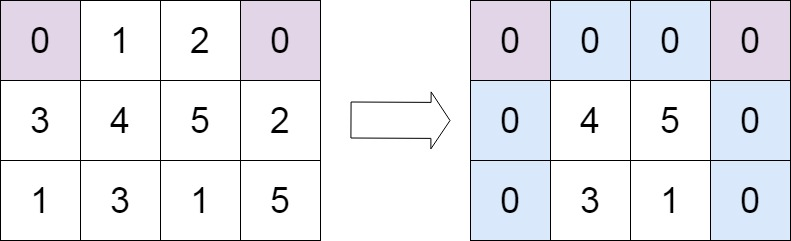

# Problem: 73. Set Matrix Zeroes

---

## Problem Description
[Link to the problem](https://leetcode.com/problems/set-matrix-zeroes/description/?envType=daily-question&envId=2025-05-21)

Given an `m x n` integer matrix `matrix`, if an element is `0`, set its entire row and column to `0`'s.

You must do it [in place](https://en.wikipedia.org/wiki/In-place_algorithm).

---

### Example 1:

Input: `matrix = [[1,1,1],[1,0,1],[1,1,1]]`

Output: `[[1,0,1],[0,0,0],[1,0,1]]`

Explanation: You are given the second node with value 5, the linked list should become 4 -> 1 -> 9 after calling your function.

### Example 2:

Input: `matrix = [[0,1,2,0],[3,4,5,2],[1,3,1,5]]`

Output: `[[0,0,0,0],[0,4,5,0],[0,3,1,0]]`

---

## Constraints:

 - `m == matrix.length`
 - `n == matrix[0].length`
 - `1 <= m, n <= 200`
 - `-2^31 <= matrix[i][j] <= 2^31 - 1`

## Follow up:
 - A straightforward solution using `O(mn)` space is probably a bad idea.
 - A simple improvement uses `O(m + n)` space, but still not the best solution.
 - Could you devise a constant space solution?
